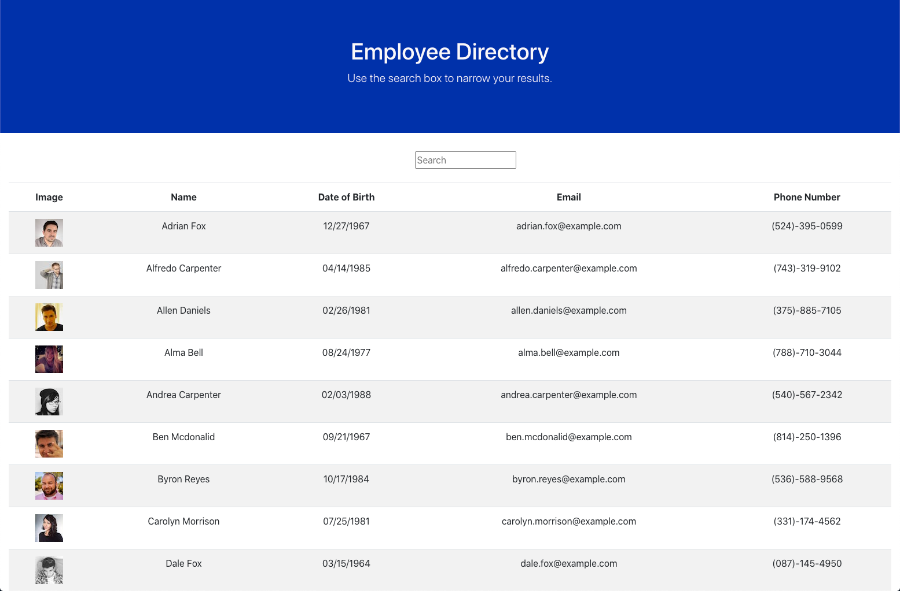

  # User Directory

  ## Table of Contents

  - [Description](#description)
  - [User Story](#Story)
  - [Image](#image)
  - [Business Context](#businesscontext)
  - [Deployment](#deployment)
  - [Contributors](#contributors)
  - [Contact](#contact)

 

  ## Description

  This application was built using React with data from the [Random User API](https://randomuser.me). It is designed to make it easy to search for employees by name or email using the search bar. The data pulled from the api is put together in a table that includes a picture, name, DOB, email and phone number of each employee. 

 ## User Story

  As a user, I want to be able to view my entire employee directory at once so that I have quick access to their information.

 
  

   ## Busines Context

  An employee or manager would benefit greatly from being able to view non-sensitive data about other employees. It would be particularly helpful to be able to filter employees by name.

  ## Deployment
  
  This app is deployed [here](https://jdavila10.github.io/User-Directory/)
  

  ## Contributors

  Jonathan Davila

    
  
  ## Contact:

  For questions about this application please contact me at: 
  - [Github Profile](https://github.com/jdavila10)
  - j.eche589@gmail.com
  
    

